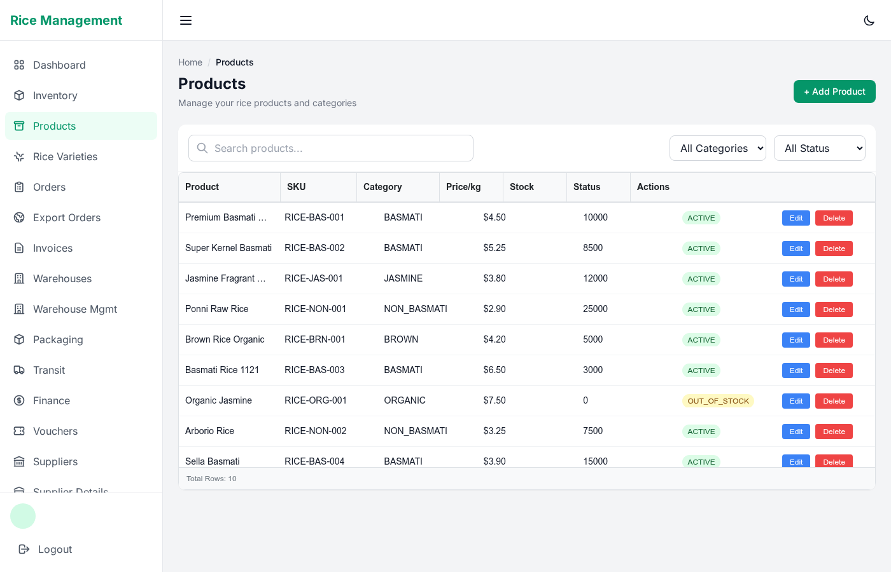

# VirtualGrid

A high-performance virtualized data grid for React, built on [react-window](https://github.com/bvaughn/react-window) with chunked data loading, LRU caching, and predictive prefetching.



## Features

- **Virtual scrolling** — renders only visible rows for smooth performance with 100k+ rows
- **Chunked data loading** — fetches data in configurable page sizes
- **LRU + IndexedDB caching** — in-memory cache with optional offline persistence
- **Predictive prefetching** — preloads adjacent chunks while idle
- **Column resize & reorder** — drag to resize, drag headers to reorder
- **Sorting & filtering** — click headers to sort, inline filter inputs
- **Row selection** — single or multi-select with checkbox support
- **Keyboard navigation** — arrow keys, space to select, Home/End/PageUp/PageDown
- **Search highlighting** — matches highlighted in filtered cells
- **Custom cell renderers** — render any JSX in cells via `cellRenderer`

## Installation

```bash
# From the rice-admin-dashboard root
npm install
# or from the virtual-grid folder
cd src/virtual-grid && npm install
```

## Quick Start

```tsx
import { VirtualGrid, ColumnDef, DataSource } from './virtual-grid/src';

const columns: ColumnDef[] = [
  { key: 'name', title: 'Name', width: 200 },
  { key: 'email', title: 'Email', width: 250 },
  { key: 'status', title: 'Status', width: 120,
    cellRenderer: ({ value }) => (
      <span className={value === 'active' ? 'text-green-600' : 'text-red-600'}>
        {value}
      </span>
    )
  },
];

const dataSource: DataSource = {
  getRows: async ({ startRow, endRow, sortModel, filterModel, searchTerm }) => {
    const res = await fetch(`/api/users?page=${startRow}&size=${endRow - startRow}`);
    const data = await res.json();
    return { rows: data.content, totalRows: data.totalElements };
  },
};

function App() {
  return <VirtualGrid columns={columns} dataSource={dataSource} rowHeight={48} />;
}
```

## API

### Props

| Prop | Type | Default | Description |
|------|------|---------|-------------|
| `columns` | `ColumnDef[]` | *required* | Column definitions |
| `dataSource` | `DataSource` | *required* | Data fetching function |
| `rowHeight` | `number` | `48` | Fixed row height in pixels |
| `height` | `number` | `500` | Grid container height |
| `width` | `number \| string` | `'100%'` | Grid container width |
| `chunkSize` | `number` | `100` | Rows per API fetch |
| `cacheSize` | `number` | `20` | Max cached chunks |
| `rowKey` | `string` | `'id'` | Unique row identifier field |
| `selectionMode` | `'none' \| 'single' \| 'multiple'` | `'none'` | Row selection mode |
| `enableSearch` | `boolean` | `false` | Show search bar |
| `enableColumnResize` | `boolean` | `true` | Allow column resizing |
| `enableColumnReorder` | `boolean` | `true` | Allow column reordering |
| `enableKeyboardNavigation` | `boolean` | `true` | Arrow key navigation |
| `onRowClick` | `(row, index) => void` | — | Row click handler |
| `onSelectionChange` | `(rows) => void` | — | Selection change handler |

### ColumnDef

| Property | Type | Description |
|----------|------|-------------|
| `key` | `string` | Data field name |
| `title` | `string` | Column header text |
| `width` | `number` | Column width in pixels |
| `sortable` | `boolean` | Enable sorting |
| `filterable` | `boolean` | Enable inline filter |
| `cellRenderer` | `(params) => ReactNode` | Custom cell renderer |
| `valueFormatter` | `(value, row) => string` | Format display value |
| `cellStyle` | `(params) => CSSProperties` | Dynamic cell styles |
| `cellClassName` | `(params) => string` | Dynamic cell class |

### Ref Methods

```tsx
const gridRef = useRef<VirtualGridRef>(null);

gridRef.current?.refresh();           // Clear cache + refetch
gridRef.current?.clearCache();        // Clear cache only
gridRef.current?.scrollToRow(50);     // Scroll to row index
gridRef.current?.getSelectedRows();   // Get selected rows
```

### DataSource

```tsx
interface DataSource {
  getRows(params: {
    startRow: number;
    endRow: number;
    sortModel?: SortModel[];
    filterModel?: FilterModel;
    searchTerm?: string;
    signal?: AbortSignal;
  }): Promise<{ rows: RowData[]; totalRows: number }>;
}
```

## Development

```bash
cd src/virtual-grid
npm install
npm run dev        # Start dev server (runs the demo in src/App.tsx)
npm run test       # Run unit tests
npm run build      # Build for production
```

The built-in demo (`src/App.tsx`) showcases a 100k-row grid with sorting, filtering, custom formatters, selection, and all grid features.

## Dependencies

- `react` ^18.3.1
- `react-dom` ^18.3.1
- `react-window` ~1.8.11
- `react-virtualized-auto-sizer` ~1.0.26

> **Note:** `react-window` and `react-virtualized-auto-sizer` are pinned to patch-only updates (`~`) to prevent breaking changes from major version upgrades.
